中文 | [English](README_en.md)

# FlexLoginUI

用于 AuthMeReloaded 的图形化认证插件，支持铁砧登录、客户端 1.21.6+ Dialog 对话框登录、Geyser 基岩版表单登录。

谁需要此插件：使用 AuthMeReloaded 做登录验证、想要跨版本认证界面、想要给Java版玩家提供铁砧/对话框登录界面、给 Geyser
基岩版玩家提供登录表单的 Minecraft 服务端服主会使用该插件。

> [!WARNING]
> 我可能没有足够的时间对此插件进行测试与开发，欢迎在 [issues](https://github.com/gxlydlyf/FlexLoginUI/issues)
> 报告问题或请求功能。将来可能会支持更多登录插件、Java版本 和 Minecraft版本

## 安装

### 必要依赖

- Java 17 及以上
- 插件服务器 1.17 及以上 （仅在 PurpurMC 经过测试）
- [AuthMeReloaded](https://www.spigotmc.org/resources/authmereloaded.6269/)
- [PacketEvents](https://www.spigotmc.org/resources/packetevents-api.80279/)

若你使用 Java 17 运行 1.17 版本 的服务端并提示Java 版本过高，请改用 Paper
MC 或 PurpurMC 服务端，并在启动命令中添加参数：`-DPaper.IgnoreJavaVersion=true`

### 可选依赖

- [ViaVersion](https://www.spigotmc.org/resources/viaversion.19254/) 为高于服务器版本客户端提供 Dialog 界面
- [ViaBackwards](https://www.spigotmc.org/resources/viabackwards.27448/) 为低于服务器版本客户端提供铁砧界面，需要先安装
  ViaVersion
- [Geyser](https://geysermc.org/download?project=geyser) 和 [Floodgate](https://geysermc.org/download?project=floodgate)
  提供基岩版表单

### 插件本体

在 [release](https://github.com/gxlydlyf/FlexLoginUI/release) 下载插件，放入服务器根目录下 `plugins` 文件夹，然后重启游戏。

## 游戏演示

### 对话框

使用 1.21.6 及以上客户端版本加入服务器可见（如果安装 ViaVersion，服务器版本可小于 1.21.6）

如果服务器版本大于等于 1.21.6，并且使用 AuthMeReloaded 6.0.0 及以上版本，并且启用 AuthMe 配置中的
settings.registration.dialog.postJoin.enable 或 settings.registration.dialog.preJoin.enable，那么将会显示 AuthMe
自己的对话框而不是此插件的对话框。

#### 垂直按钮

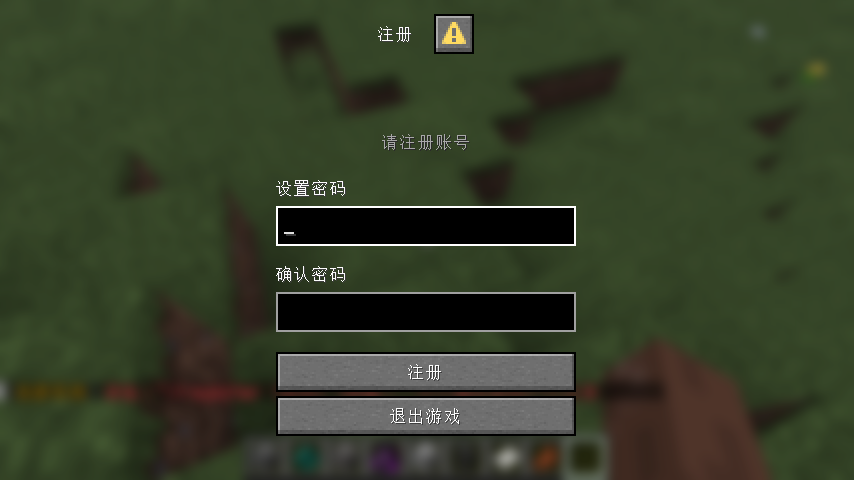
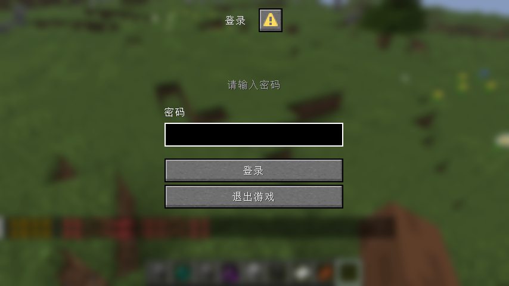

#### 水平按钮

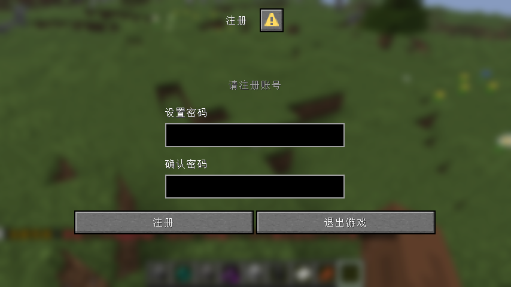
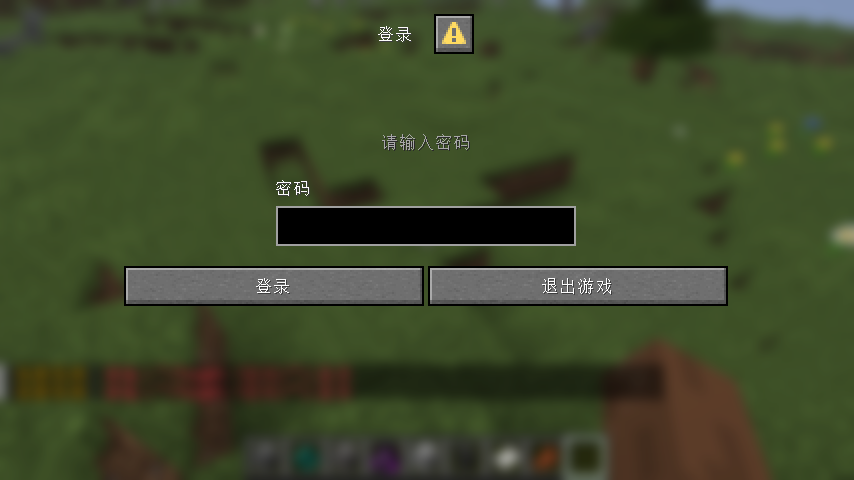

### 铁砧

使用 1.21.6 以下客户端版本加入服务器可见

#### 注册

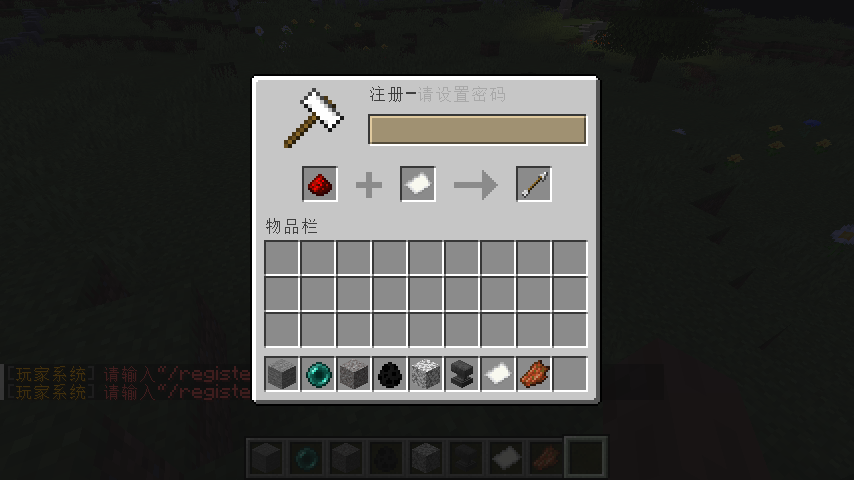
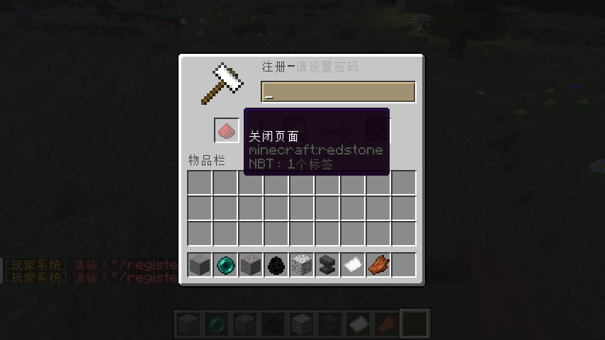
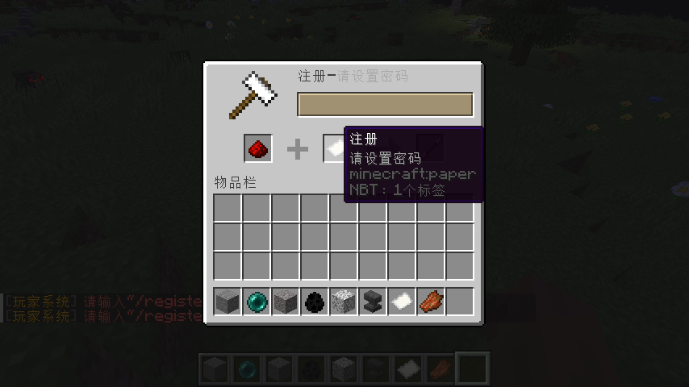
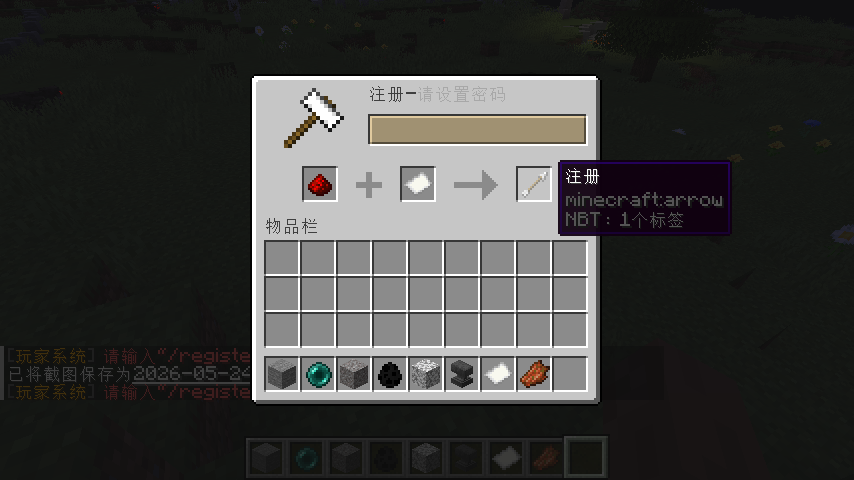
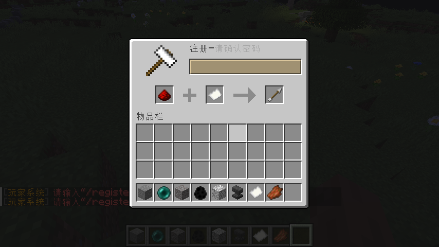

#### 登录

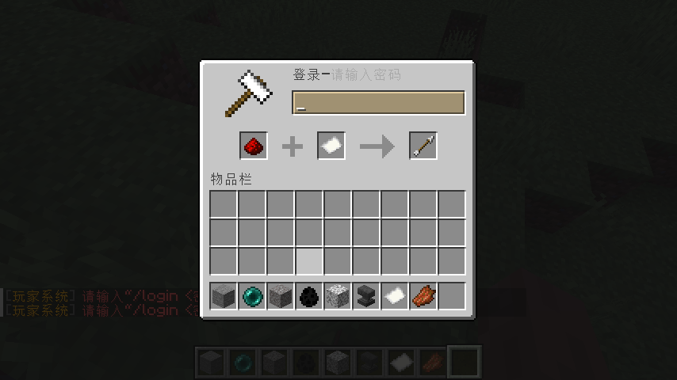
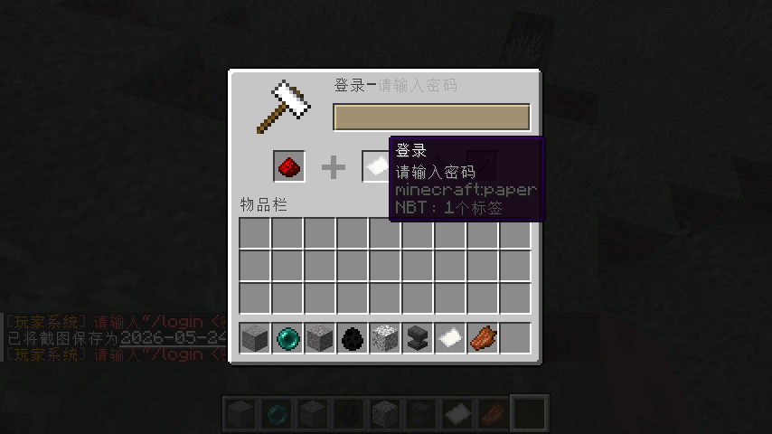

### 基岩版表单

通过 Geyser 加入的用户可见

如果服务器版本大于等于 1.21.6，并且使用 AuthMeReloaded 6.0.0 及以上版本，并且启用 AuthMe 配置中的
settings.registration.dialog.preJoin.enable，那么 Geyser 将会自动把 AuthMe
预加入对话框 转化为 基岩版表单，此插件会对表单进行一些样式修改，表单中的文本将由 AuthMe 提供。

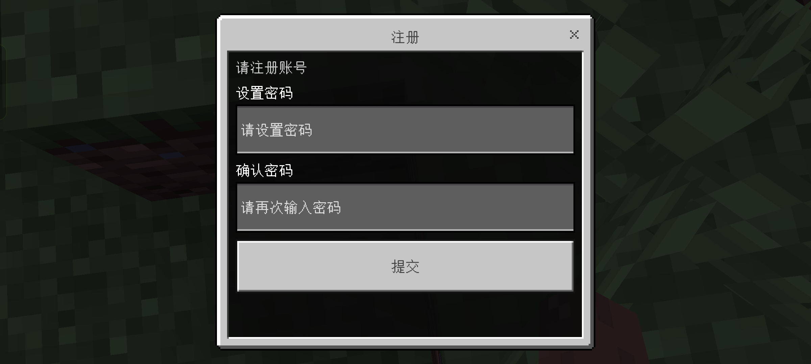
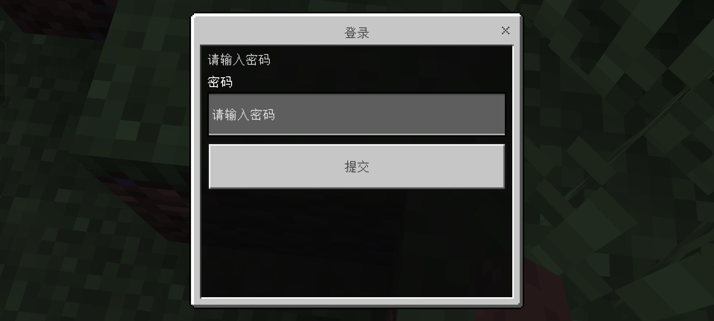

## 命令用法

### `/flexloginui`

别名 `/flui`

用于插件管理

参数：

- `reload` 重载插件配置

### `/logui`

用于开启登录UI界面

### `/regui`

用于开启注册UI界面

`/regui` 和 `/logui` 命令需要添加到 AuthMe 配置中 settings.restrictions.allowCommands 才能使用

## 权限

### flexloginui.commands.*

默认拥有：全部玩家

子权限：

- `flexloginui.commands.login` 使用 /logui 命令
- `flexloginui.commands.register` 使用 /regui 命令

### flexloginui.commands.manager

使用 /flexloginui 命令

默认拥有：仅管理员

### flexloginui.pages.*

允许给玩家展示的 UI

默认拥有：全部玩家

子权限：

- `flexloginui.pages.bedrock`
- `flexloginui.pages.dialog`
- `flexloginui.pages.anvil`

## 配置文件

运行插件后，会在 `plugins` 中插件目录中生成 `langs` `default_configs` 目录 和 `config.yml` 文件

`langs` 中为语言文件

`default_configs` 中为默认配置文件，不要修改其中内容，否则下次启动时会覆盖为默认

### config.yml

- `config-version`: 配置文件版本，不要修改
- `debug`: 是否开启调试模式
- `language`: 语言位置文件，请填写 `langs` 目录下 YAML 文件名
- `text`: 登录页面的相关文本

#### `pages` 设置登录页面

- `.dialog.allow_close` `.anvil.allow_close` `.bedrock.allow_close`: 是否允许关闭页面，不允许时，关闭按钮将显示为退出游戏按钮。
- `.dialog.horizontal_buttons`: 是否要水平显示对话框页面的按钮

## 开源协议

本项目使用 MIT License 开源。

附加了 [boosted-yaml](https://github.com/dejvokep/boosted-yaml) 项目，采用 Apache 2.0 许可。

## 问题

如使用时报错、需要新功能或提出建议，请到 [issues](https://github.com/gxlydlyf/FlexLoginUI/issues) 反馈。

## 贡献

1. **Fork** 本仓库
2. 创建你的功能分支 (`git checkout -b feature/AmazingFeature`)
3. 提交修改 (`git commit -m 'Add some AmazingFeature'`)
4. 推送到分支 (`git push origin feature/AmazingFeature`)
5. 打开 **Pull Request**