[中文](README.md) | English

# FlexLoginUI

Graphical authentication plugin for AuthMeReloaded. Supports Anvil login, 1.21.6+ Dialog UI login and Geyser Bedrock
form
login.

> [!WARNING]
> I may not have sufficient time for plugin development and testing. Issues reports are welcomed. Support for more login
> plugins, Java versions and Minecraft versions may be added in future updates.

## Installation

### Required Dependencies

- Java 17 or above
- Server version 1.17 or above (Only tested on PurpurMC)
- [AuthMeReloaded](https://www.spigotmc.org/resources/authmereloaded.6269/)
- [PacketEvents](https://www.spigotmc.org/resources/packetevents-api.80279/)

If you run a 1.17 server with Java 17 and get a prompt saying the Java version is too new, use PaperMC or PurpurMC
instead, and add `-DPaper.IgnoreJavaVersion=true` to your startup command.

### Optional Dependencies

- [ViaVersion](https://www.spigotmc.org/resources/viaversion.19254/) Provides dialog UI for clients running a newer
  version than the server.
- [ViaBackwards](https://www.spigotmc.org/resources/viabackwards.27448/) Provides anvil UI for clients running an older
  version than the server. You need to install ViaVersion first。
- [Geyser](https://geysermc.org/download?project=geyser) & [Floodgate](https://geysermc.org/download?project=floodgate)
  Enables login form for Bedrock Edition players

### Plugin Setup

Download the plugin from [release](https://github.com/gxlydlyf/FlexLoginUI/release), place it into the `plugins` folder
under server root directory, then restart the server.

## Game Preview

### Dialog UI

Visible for clients running 1.21.6 and above (If ViaVersion is installed, the server version can be lower than 1.21.6)

If the server version is 1.21.6 or higher, AuthMeReloaded 6.0.0 or newer is installed, and either
settings.registration.dialog.postJoin.enable or settings.registration.dialog.preJoin.enable in the AuthMe configuration
is enabled, the native AuthMe dialog will be displayed instead of this plugin's dialog.

#### Vertical Buttons

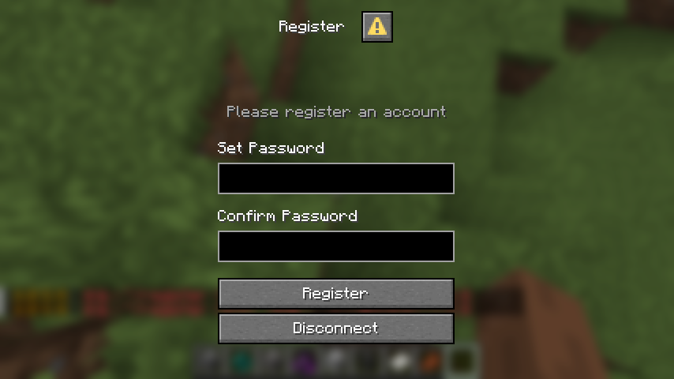
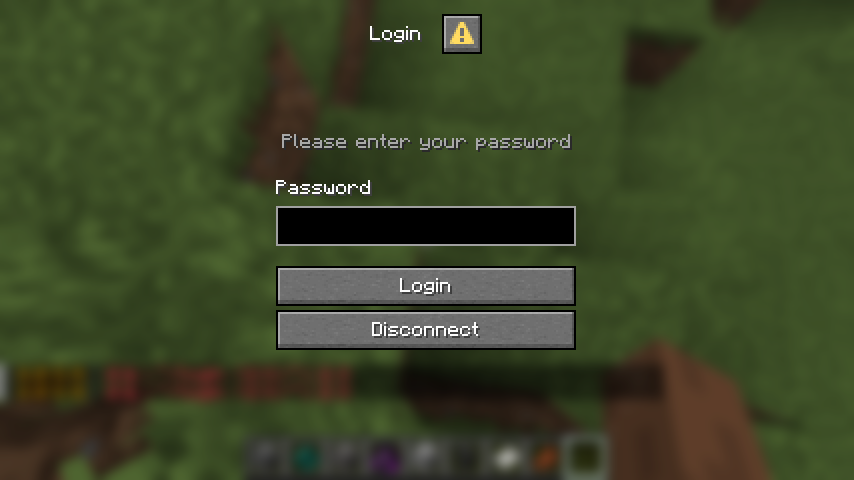

#### Horizontal Buttons

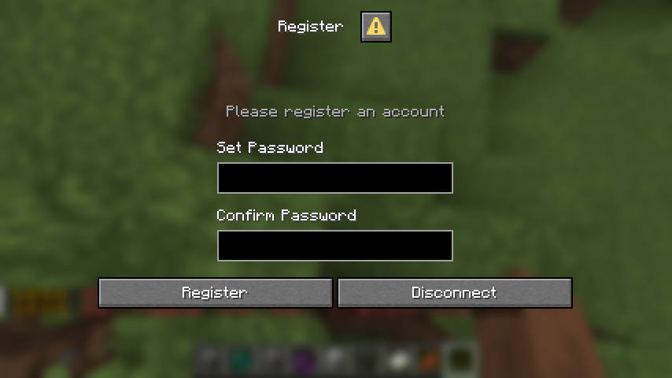
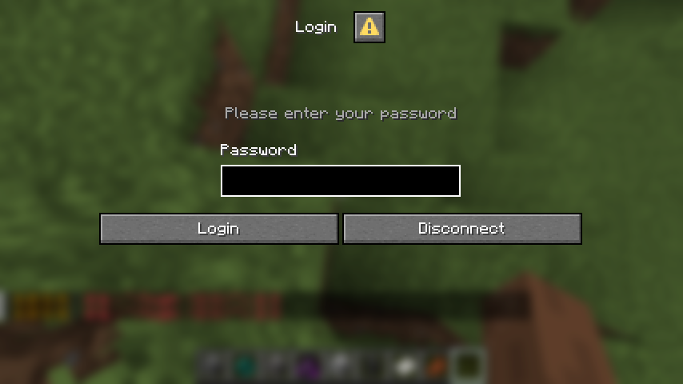

### Anvil UI

Visible for clients below 1.21.6

#### Register

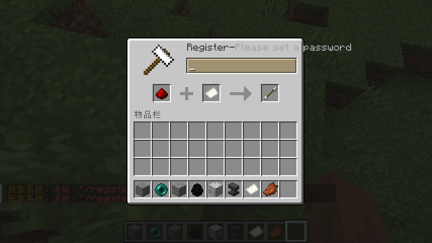
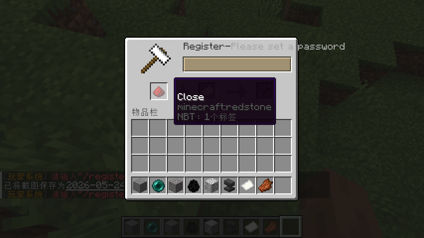
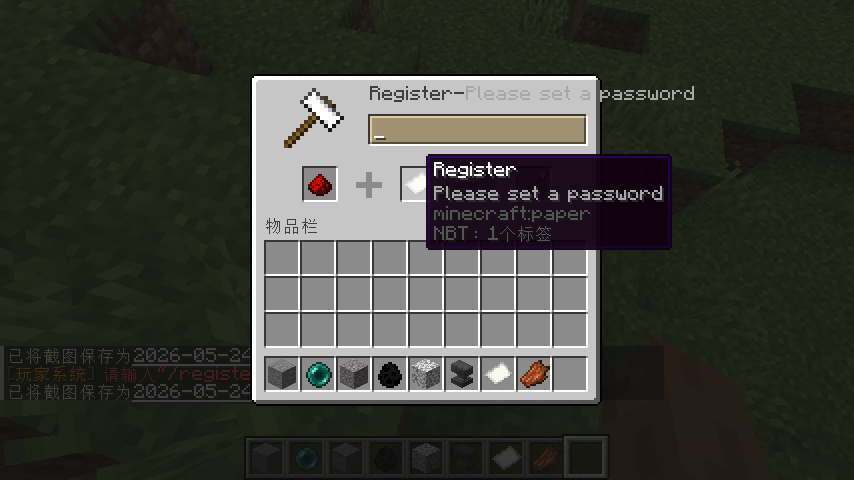
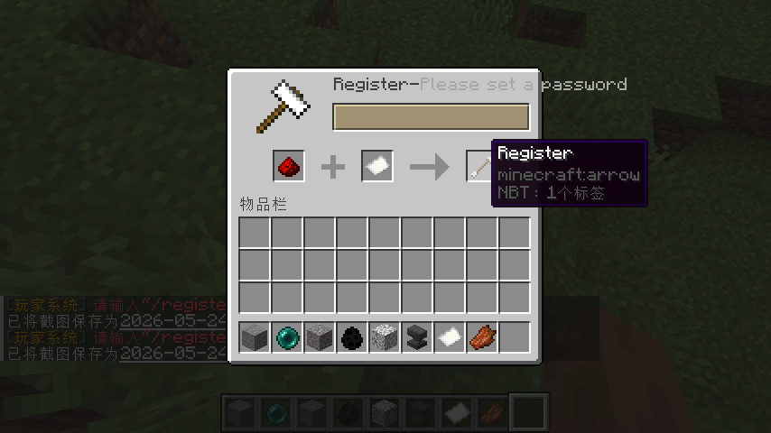
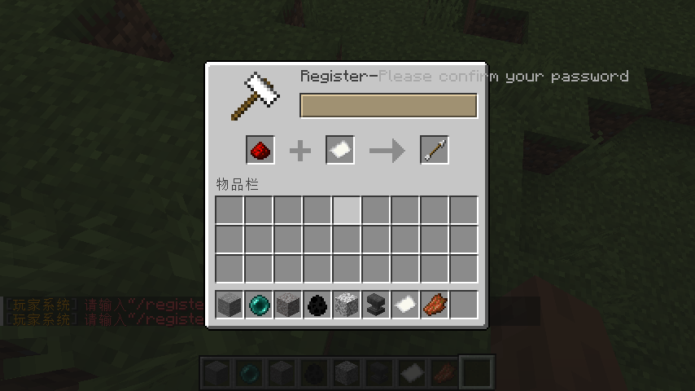

#### Login

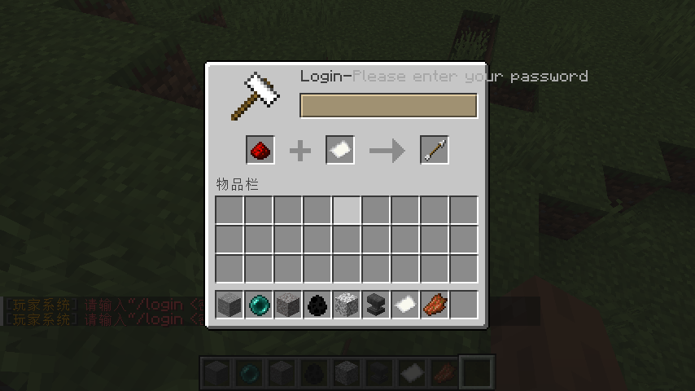
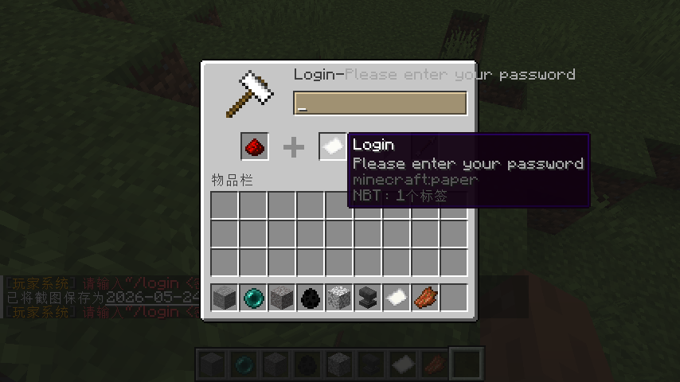

### Bedrock Form

Available for players joining via Geyser
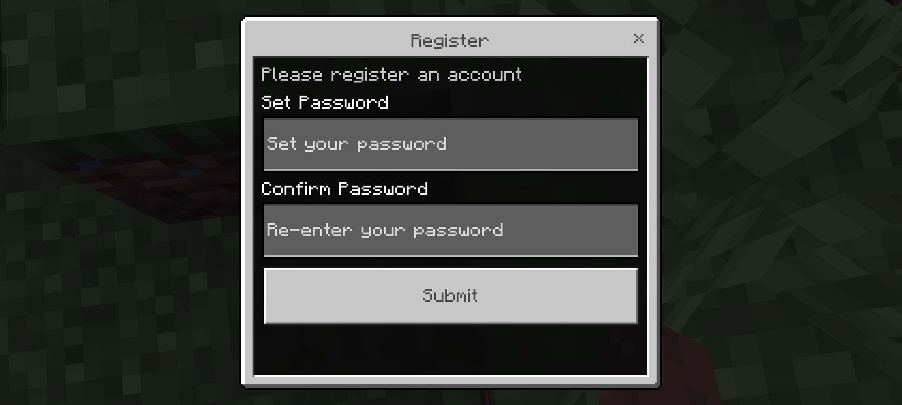
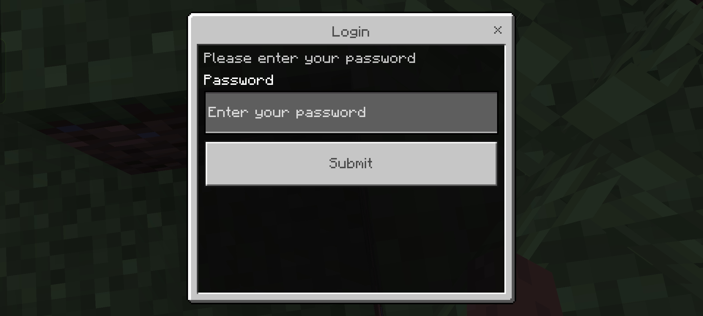

## Commands

### `/flexloginui`

Alias: `/flui`
Plugin management command

Arguments:

- `reload` Reload plugin configuration

### `/logui`

Open login interface

### `/regui`

Open registration interface

To use the `/regui` and `/logui` commands, you need to add them to settings.restrictions.allowCommands in the AuthMe
configuration.

## Permissions

### flexloginui.commands.*

Default: All players

Sub-permissions:

- `flexloginui.commands.login` Use /logui
- `flexloginui.commands.register` Use /regui

### flexloginui.commands.manager

Access /flexloginui command

Default: Administrators only

### flexloginui.pages.*

Control accessible UI interfaces for players

Default: All players

Sub-permissions:

- `flexloginui.pages.bedrock`
- `flexloginui.pages.dialog`
- `flexloginui.pages.anvil`

## Configuration Files

After initial startup, folders named `langs`, `default_configs` and file `config.yml` will be generated inside the
plugin directory under `plugins`.

Language files are stored in the `langs` folder.

Do not modify files inside `default_configs`, changes will be overwritten automatically.

### config.yml

- `config-version`: Configuration file version, do not edit
- `debug`: Toggle debug mode
- `language`: Target language file name inside `langs` folder
- `text`: Customizable texts displayed on login UI

#### `pages` UI Settings

- `.dialog.allow_close`, `.anvil.allow_close`, `.bedrock.allow_close`: Toggle page closing action. If disabled, close
  button will turn into exit game button.
- `.dialog.horizontal_buttons`: Switch dialog buttons between horizontal and vertical layout

## License

This project is licensed under MIT License.

The embedded [boosted-yaml](https://github.com/dejvokep/boosted-yaml) library uses Apache 2.0 License.

## Issues

Submit bugs and suggestions at [issues](https://github.com/gxlydlyf/FlexLoginUI/issues).

## Contributing

1. **Fork** this repository
2. Create your feature branch (`git checkout -b feature/AmazingFeature`)
3. Commit your changes (`git commit -m 'Add some AmazingFeature'`)
4. Push to the branch (`git push origin feature/AmazingFeature`)
5. Create a **Pull Request**