[中文](README.md) | English

# FlexLoginUI

Graphical authentication plugin for AuthMeReloaded. Supports Anvil authentication, clients 1.21.6+ Dialog UI
authentication and Geyser
Bedrock form authentication.

Who needs this plugin: Minecraft server administrators utilizing AuthMeReloaded for authentication, desiring
cross-version authentication UIs, and looking to provide anvil/dialog authentication screens for Java Edition players as
well as authentication
forms for Geyser Bedrock Edition players.

> [!WARNING]
> I may not have sufficient time for further plugin testing and development. Feel free to submit bug reports or feature
> requests via [issues](https://github.com/gxlydlyf/FlexLoginUI/issues). Support for additional authentication plugins,
> Java versions and Minecraft game versions may be added in future updates.

## Installation

### Required Dependencies

- Java 8 or above
- Server version 1.14 or above (Only tested on PurpurMC)
- [AuthMeReloaded](https://www.spigotmc.org/resources/authmereloaded.6269/)
- [PacketEvents](https://www.spigotmc.org/resources/packetevents-api.80279/)

### Optional Dependencies

- [ViaVersion](https://www.spigotmc.org/resources/viaversion.19254/) Provides dialog UI for clients running a newer
  version than the server.
- [ViaBackwards](https://www.spigotmc.org/resources/viabackwards.27448/) Provides anvil UI for clients running an older
  version than the server. You need to install ViaVersion first。
- [Geyser](https://geysermc.org/download?project=geyser) & [Floodgate](https://geysermc.org/download?project=floodgate)
  Enables login form for Bedrock Edition players

### Plugin Setup

Download the plugin from [release](https://github.com/gxlydlyf/FlexLoginUI/release).

- The version with `-downgraded` suffix (e.g. `FlexLoginUI-1.3.1-downgraded.jar`) is for **Java 8 ~ 20**
- The version without `-downgraded` suffix (e.g. `FlexLoginUI-1.3.1.jar`) is for **Java 21 and above**

Place the downloaded jar into the `plugins` folder under server root directory, then restart the server.

## Game Preview

### Dialog UI

Visible for clients running 1.21.6 and above (If ViaVersion is installed, the server version can be lower than 1.21.6)

If the server version is 1.21.6 or higher, AuthMeReloaded 6.0.0 or newer is installed, and either
settings.registration.dialog.postJoin.enable or settings.registration.dialog.preJoin.enable in the AuthMe configuration
is enabled, the native AuthMe dialog will be displayed instead of this plugin's dialog.

#### Vertical Buttons

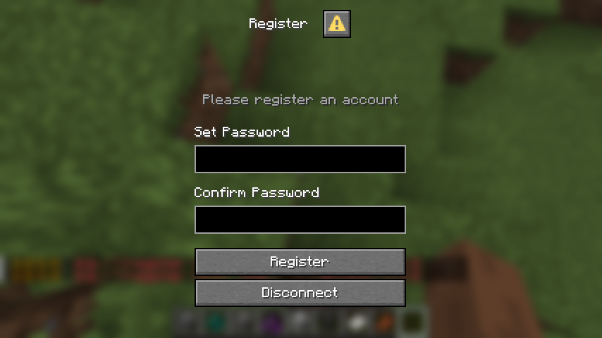
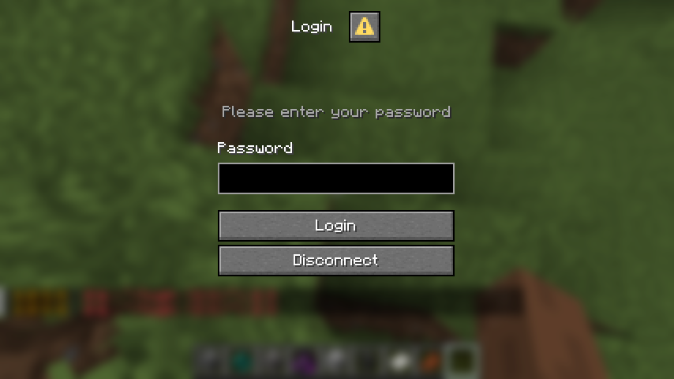
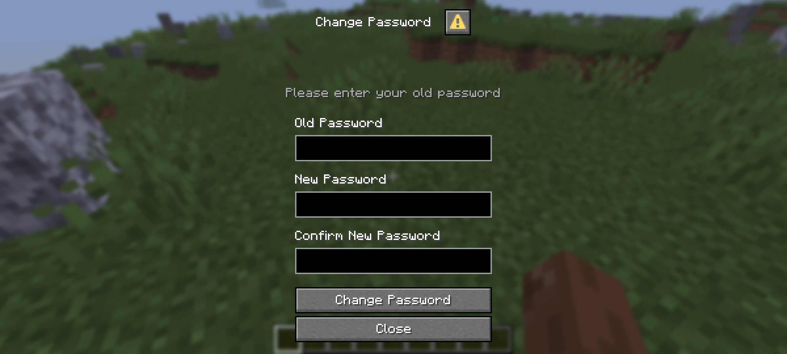

#### Horizontal Buttons

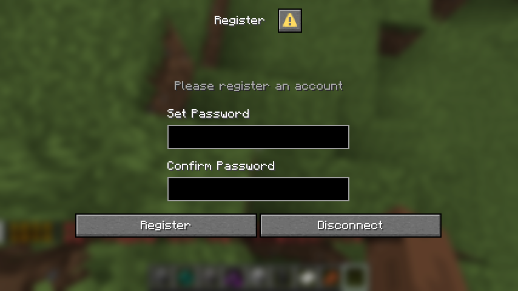
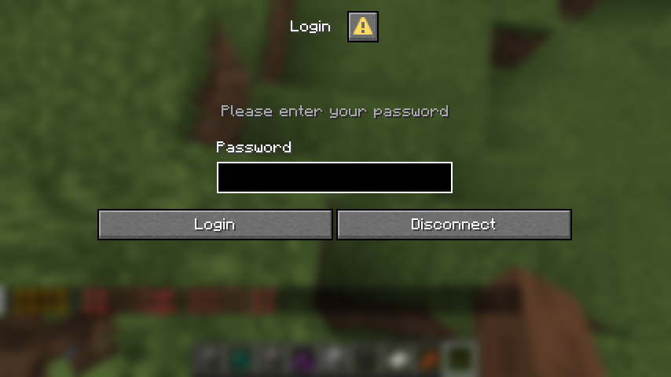
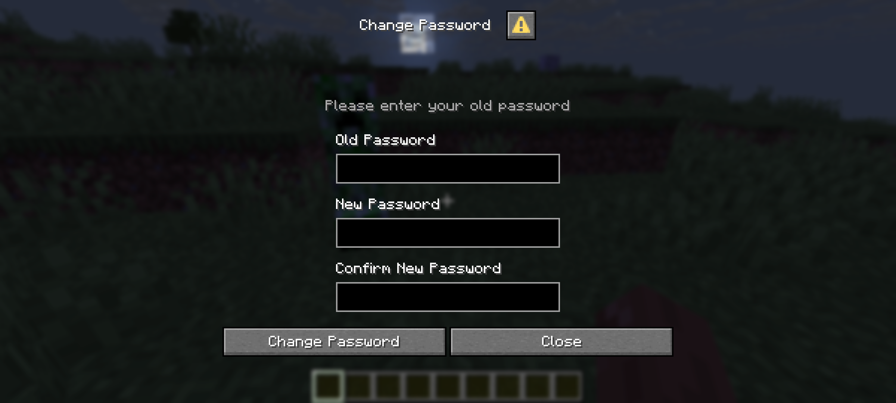

### Anvil UI

Visible for clients below 1.21.6

#### Register

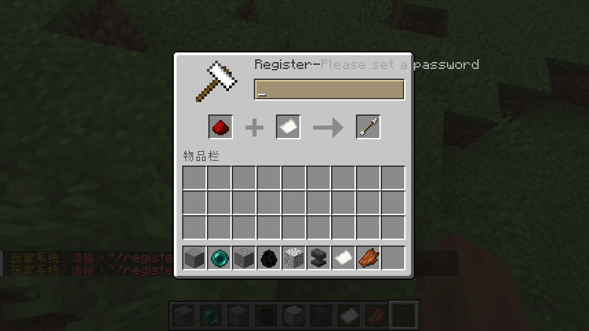
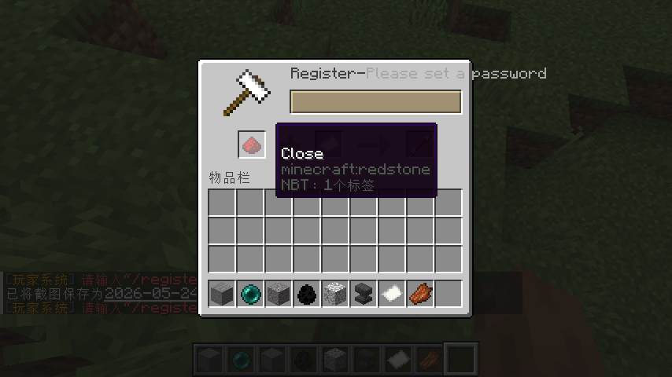
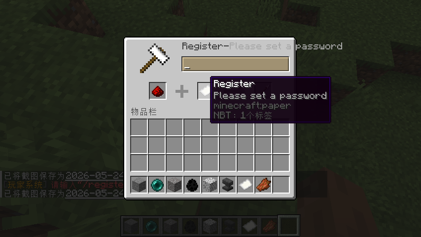
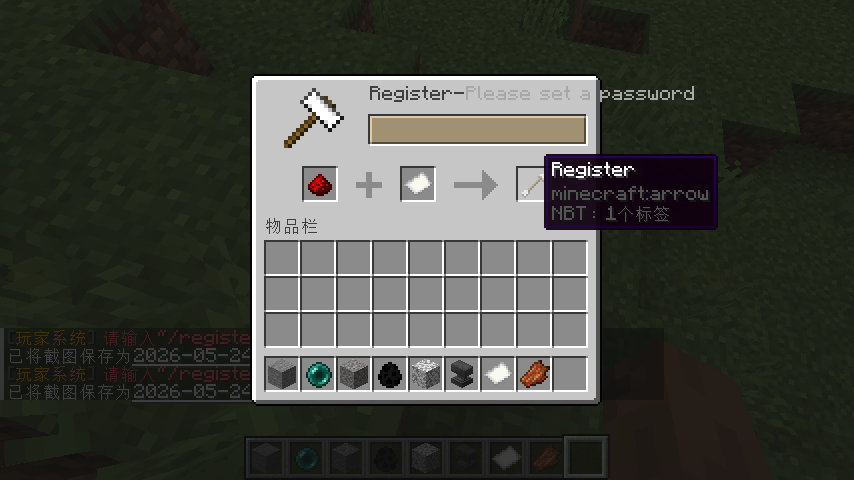
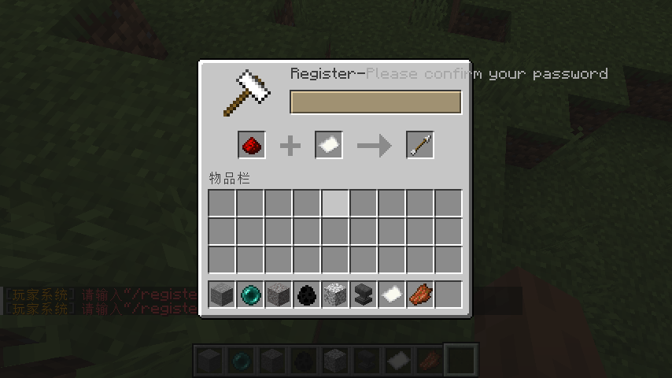

#### Login

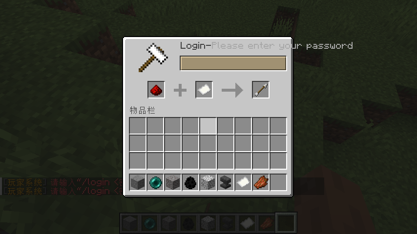
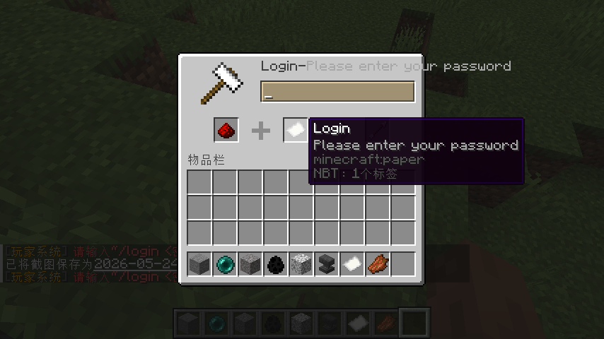

#### Change password

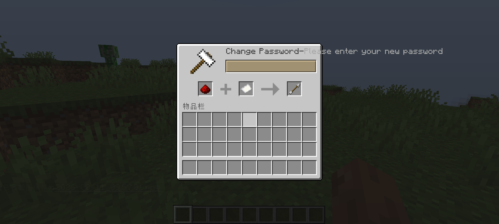
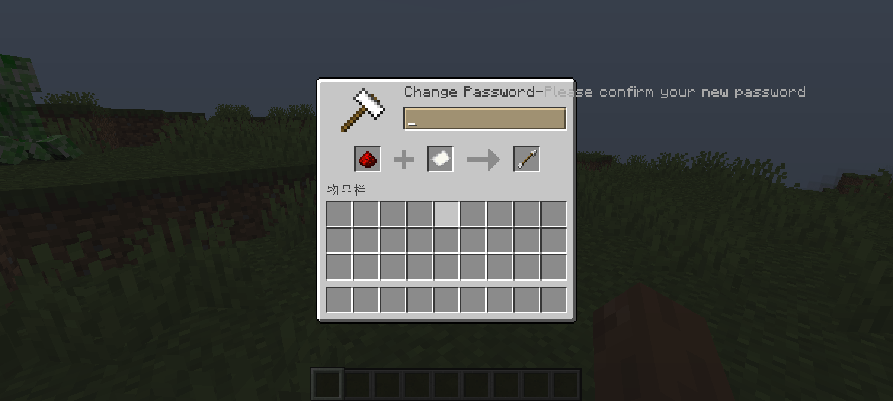

### Bedrock Form

Available for players joining via Geyser

If the server version is 1.21.6 or higher, AuthMeReloaded 6.0.0 or newer is in use, and
settings.registration.dialog.preJoin.enable is enabled in the AuthMe configuration, Geyser will automatically convert
the AuthMe pre-join registration dialog into a Bedrock Edition form. This plugin applies several styling modifications
to the form, with all form text sourced from AuthMe.

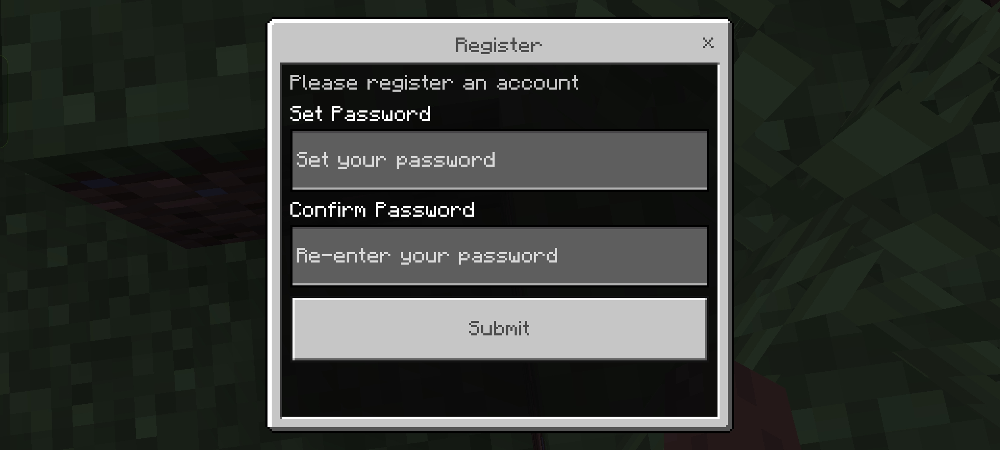
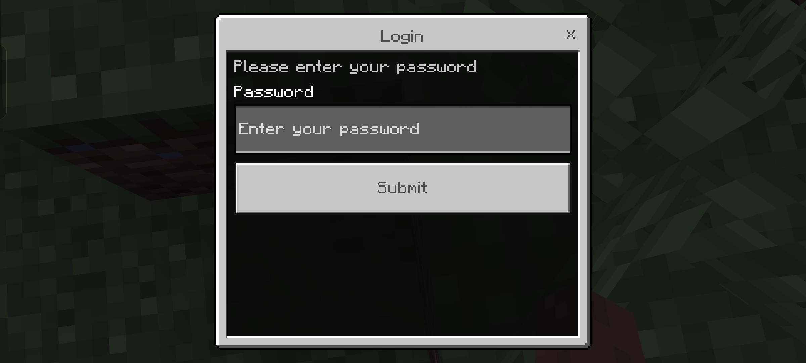
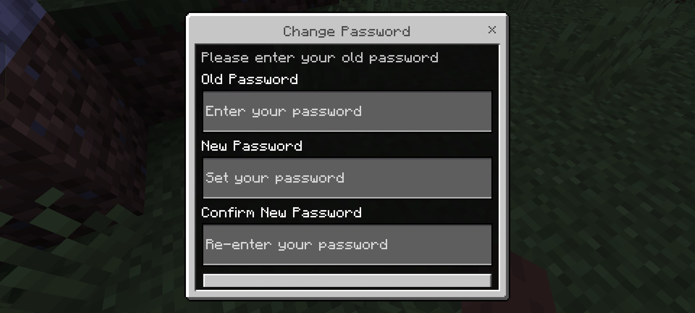

## Commands

### `/flexloginui`

Alias: `/flui`
Plugin management command

Arguments:

- `reload` Reload plugin configuration

### `/logui`

Open login interface

### `/regui`

Open registration interface

To use the `/regui` and `/logui` commands, you need to add them to settings.restrictions.allowCommands in the AuthMe
configuration.

### `/changepasswordui` `/cpwdui`

Open the password change interface

## Permissions

### flexloginui.commands.*

Default: All players

Sub-permissions:

- `flexloginui.commands.login` Use /logui
- `flexloginui.commands.register` Use /regui
- `flexloginui.commands.change_password` Use /changepasswordui

### flexloginui.commands.manager

Access /flexloginui command

Default: Administrators only

### flexloginui.pages.*

Control accessible UI interfaces for players

Default: All players

Sub-permissions:

- `flexloginui.pages.bedrock`
- `flexloginui.pages.dialog`
- `flexloginui.pages.anvil`

## Configuration Files

After initial startup, folders named `langs`, `default_configs` and file `config.yml` will be generated inside the
plugin directory under `plugins`.

Language files are stored in the `langs` folder.

Do not modify files inside `default_configs`, changes will be overwritten automatically.

### config.yml

- `config-version`: Configuration file version, do not edit
- `debug`: Toggle debug mode
- `language`: Target language file name inside `langs` folder
- `text`: Customizable texts displayed on login UI

#### `pages` UI Settings

- `.dialog.allow_close`, `.anvil.allow_close`, `.bedrock.allow_close`: Toggle page closing action. If disabled, close
  button will turn into exit game button.
- `.dialog.horizontal_buttons`: Switch dialog buttons between horizontal and vertical layout

## License

This project is licensed under MIT License.

### Third-Party License Notices

#### boosted-yaml

This project embeds the [boosted-yaml](https://github.com/dejvokep/boosted-yaml) library, which is licensed under Apache 2.0 License.

Full license text: [`src/main/resources/META-INF/third-party/boosted-yaml-LICENSE`](src/main/resources/META-INF/third-party/boosted-yaml-LICENSE)

#### JvmDowngrader

This project uses [JvmDowngrader](https://github.com/unimined/JvmDowngrader) to downgrade Java 21 bytecode to Java 8-compatible bytecode during the build process.

- **JvmDowngrader is used only during the build process** of this project. It is not distributed with the plugin and does not affect the final plugin artifact.
- **End users**: Users who download and use this plugin (including those running paid servers) **do not need** to purchase any commercial license from the JvmDowngrader author.
- **Plugin developers**: If you wish to use or modify the JvmDowngrader build process in your own project, please follow these licensing terms:
  1. **Non-commercial use**: Licensed under LGPLv2.1, free to use;
  2. **Commercial/profit use** (e.g., integrating JvmDowngrader into your own commercial product): A commercial license must be purchased from the author.

Full license text and legal information: [`license-thirdparty/JvmDowngrader-LICENSE.md`](license-thirdparty/JvmDowngrader-LICENSE.md)

> The main code of this project is licensed under MIT and is not subject to the LGPL copyleft of JvmDowngrader.

## Issues

Please report bugs, feature requests or suggestions via [issues](https://github.com/gxlydlyf/FlexLoginUI/issues) if you
encounter errors or have any requirements.

## Contributing

1. **Fork** this repository
2. Create your feature branch (`git checkout -b feature/AmazingFeature`)
3. Commit your changes (`git commit -m 'Add some AmazingFeature'`)
4. Push to the branch (`git push origin feature/AmazingFeature`)
5. Create a **Pull Request**